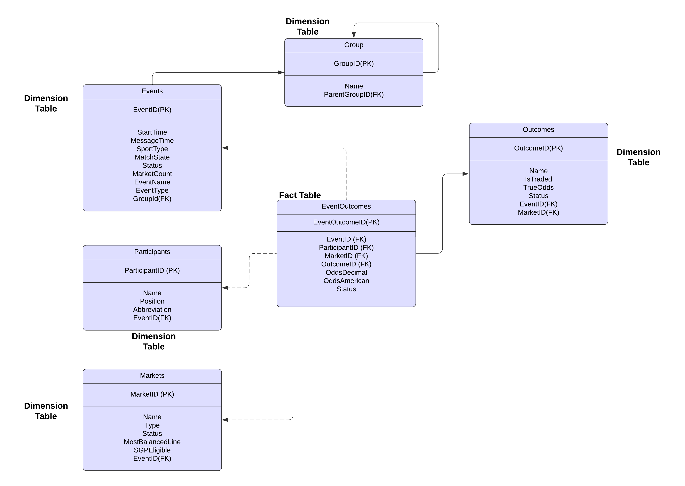

# tipico-data-ingestor

Tipico Data Ingestor Airflow Dag and DBT

The airflow dag runs on Google cloud runner and outputs to this gcs bucket 
https://console.cloud.google.com/storage/browser/data-fetch-output;tab=objects?hl=en&project=growthscript&prefix=&forceOnObjectsSortingFiltering=false. 

The dag should be inside of the enviroment provided but if you need to reupload it run this command. 

 gcloud composer environments storage dags import \
    --environment  tipico-data-ingestor \
    --location us-central1 \
    --source="dags/data-fetcher.py"

Data Model for downloaded data
